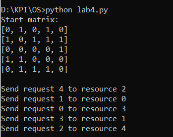

# Lab4
## 	Скласти програму визначення (локалізації) зони пошуку розв’язку для графа з пересилками (число вершин не менше 30).
Оскільки означення термінів "зони пошуку розв'язку для графа" та "граф з пересилками" не були знайдені,
тому було зроблено припущення що в завданні вимагається знайти найкращу комбінацію елемнтів графу.  
Граф було представлено за допомогою матриці, де стовпці це ресурси, а рядки це завдання.
Тобто знайти оптимальну комбінацію ресурсів і завдань.  
### Алгоритм
1. Створюєм одновимірний масив `resources` та `requests`, довжина яких дорівнює кількості рядків початкової матриці  
2. Ітеруємся по матриці:
    а) Шукаєм мінімальний рядок в початковій матриці, починаючи із `i-того` рядка.
    б) Міняєм `i-тий` рядок із мінімальним в базовій матриці і в матриці resourse
    в) Виконуєм аналогічні операції для стовпців
    г) Комбінація resourсes[i], requests[i] буде оптимальною комбінацією.

